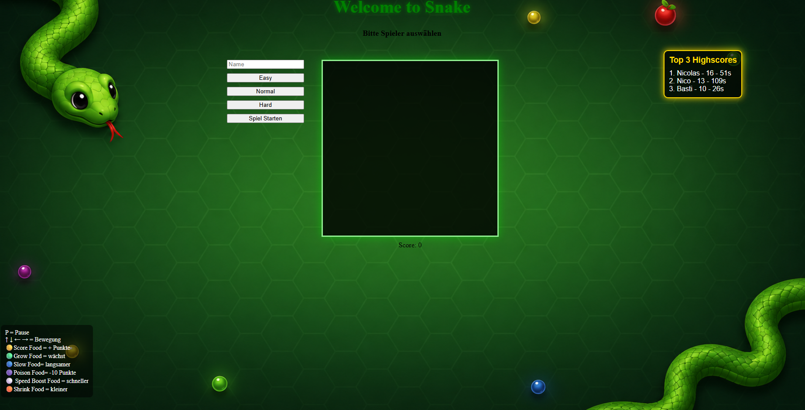

## Snake Game
Ein erweitertes Snake-Spiel für den Browser mit Spieler-System, Datenbank, Special-Food und verschiedenen Maps. Der Spieler steuert eine Schlange, die durch das Essen von Objekten wächst. Ziel ist es, möglichst viele Punkte zu sammeln, ohne mit sich selbst, Hindernissen oder dem Spielfeldrand zu kollidieren.

## Funktionen

### Spieler-System
- Spieler erstellen und speichern
- Highscores speichern
- Top-3-Highscores anzeigen
  
### Timer anzeigen
- Score und Zeit
- Score anzeigen

### Gameplay
- Spielfeld mit HTML5 Canvas
- Steuerung der Schlange mit Pfeiltasten
- Grundlegende Bewegung der Schlange
- Pausieren des Spiels
- Geschwindigkeit steigt im Laufe des Spiels
- Die Snake ändert beim Essen ihre Farbe

### Schwierigkeitsstufen
  ### Easy
    - Langsamere Startgeschwindigkeit
    - Keine Hindernisse
    - Niedriger Punkte-Multiplikator
    - Rasterfeld
  ### Normal
    - Mittlere Geschwindigkeit
    - Zusätzliche Hindernisse
    - Erhöhter Punkte-Multiplikator
  ### Hard
    - Höhere Startgeschwindigkeit
    - Mehr Hindernisse
    - Höchster Punkte-Multiplikator
### Maps und Events
- Unterschiedliche Hintergründe je nach Schwierigkeit
- Unterschiedliche Hindernis-Texturen je nach Map / Schwierigkeit
- Zufälliges Secret-Map-Event
- Bewegliche Hindernisse in der Secret Map

### Special Food System
Verschiedene Spezial-Foods mit zufälligem Spawn. Der Spawn-Cooldown hängt von der gewählten Schwierigkeit ab:

- Easy: 20 Sekunden
- Normal: 15 Sekunden
- Hard: 10 Sekunden
  ###Effekte
  - 🟡 Punkte-Food – Gibt zusätzlich +3 Punkte.
  - 🟢 Wachstums-Food – Die Schlange wächst um 2 Blöcke.
  - 🔵 Verlangsamungs-Food – Verlangsamt die Schlange für 10 Sekunden.
  - 🟣 Gift-Food – Zieht 10 Punkte vom Score ab.
  - ⚪ Speed-Boost-Food – Erhöht die Geschwindigkeit für 10 Sekunden.
  - 🟠 Shrink-Food – Verkleinert die Schlange um 2 Blöcke.

## Technologien
- JavaScript (Spiel-Logik)
- HTML5 Canvas (Rendering)
- CSS (Benutzeroberfläche)
- Python (Server-Logik)
- Flask (Web-Framework)
- SQLite (Datenbank für Spieler und Highscores)

## Voraussetzungen
- Python 3.13+
- Abhängigkeiten aus requirements.txt

## Installation
1. Projekt herunterladen oder klonen
2. Abhängigkeiten installieren:
   - pip install -r requirements.txt
     
3. Spiel starten:
   - python main.py

4. Anschließend im Browser öffnen:

http://127.0.0.1:5000

## Steuerung
- Pfeiltaste ↑ – Nach oben bewegen
- Pfeiltaste ↓ – Nach unten bewegen
- Pfeiltaste ← – Nach links bewegen
- Pfeiltaste → – Nach rechts bewegen
- P – Spiel pausieren, erneut drücken zum Fortsetzen
  
## Spielziel
Sammle möglichst viele Punkte, überlebe so lange wie möglich und erreiche einen Platz in den Top 3 der Highscoreliste.
